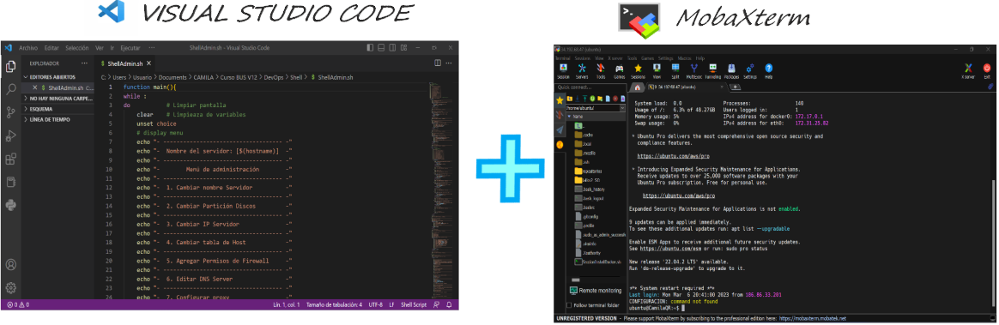
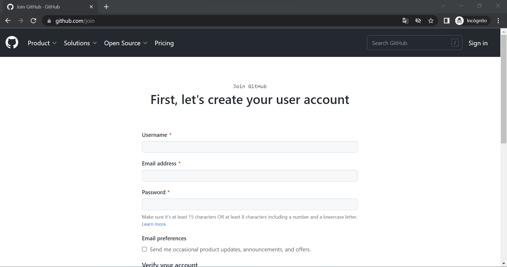
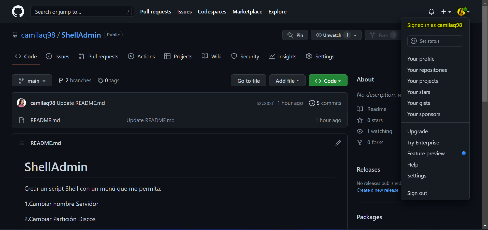
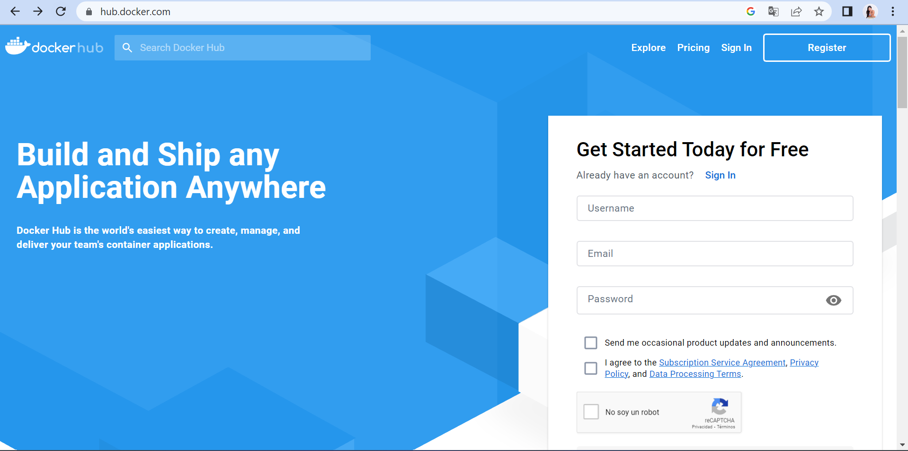
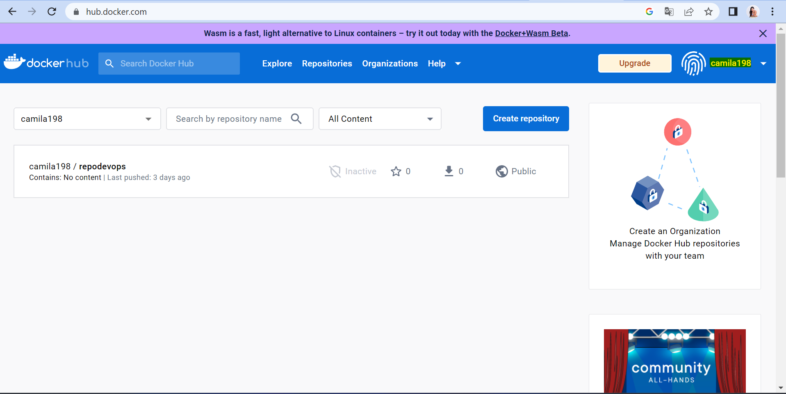

***<h1 align="center">TALLER 1 DOCKER</h1>***

***CONFIGURACIÓN DE HERRAMIENTAS DE DESARROLLO*** 

Se tiene el visual para realizar los códigos necesarios y en el moba está instalada la máquina de AWS para la ejecución de los comandos.

***CREAR CUENTA EN GITHUB*** 

Para crear la cuenta debes ingresar al siguiente link: https://github.com/join 
.Te aparecerá una ventana como la que se muestra a continuación.

  

Llenas todos los campos y a continuación estarás dentro de tu cuenta. La ventana se mostrará de la siguiente manera:

  

***CREAR CUENTA EN DOCKERHUB***

Para crear la cuenta debes ingresar al siguiente link: https://hub.docker.com/signup
.Te aparecerá una ventana como la que se muestra a continuación.

  

Llenas todos los campos y a continuación estarás dentro de tu cuenta. La ventana se mostrará de la siguiente manera:

  

  

***CREACIÓN DEL REPOSITORIO***
