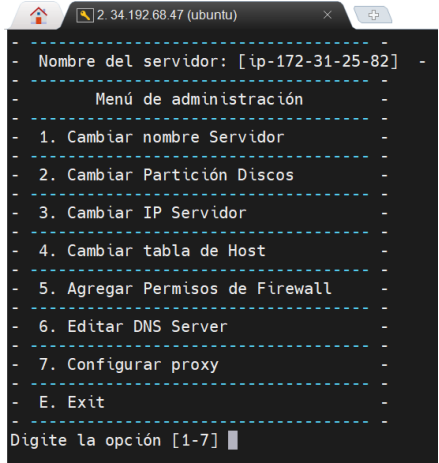
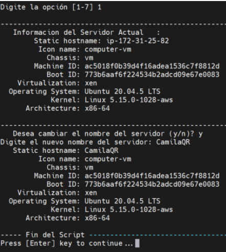
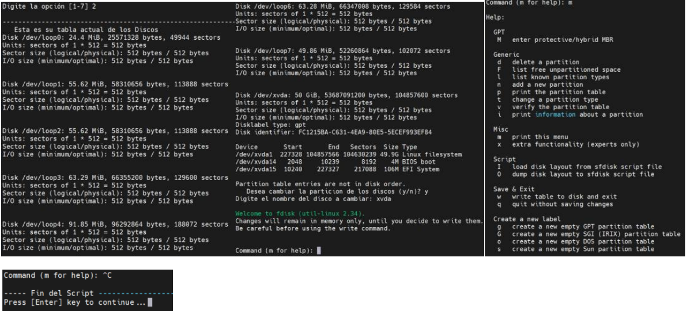
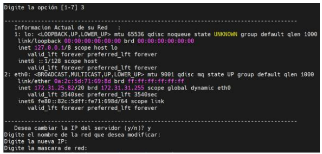
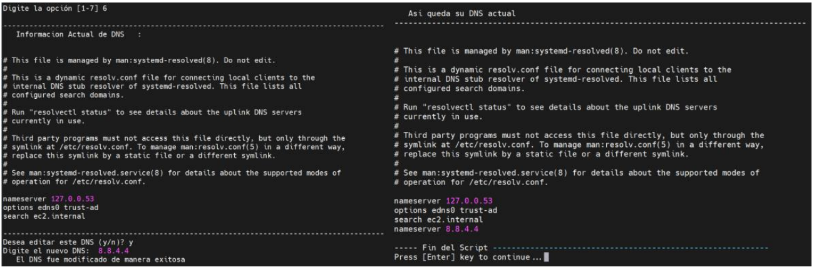
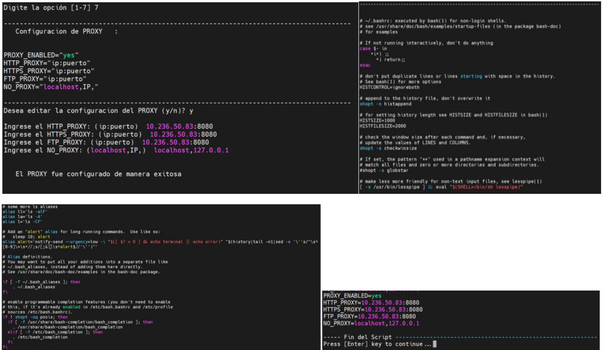

***<h1 align="center">TALLER 2 SISTEMAS OPERATIVOS</h1>***
---
***EXPLICACIÓN DE LA SHELL DE ADMINISTRACIÓN*** 

Se hace la creación del menú que permita al usuario elegir la opción que quiera cambiar, agregar, editar, configurar o salir.

***OPCIÓN 1:***

El usuario podrá cambiar el nombre del servidor.

Apenas digite la opción 1 le aparecerá la información actual del servidor, es aquí donde podrá evidenciar su hostname. Luego le preguntará si desea cambiar el nombre, al darle y (sí) volverá a mostrar la información actualizada del servidor, por último, dará enter y estará nuevamente en el menú principal.

***OPCIÓN 2:***

El usuario podrá cambiar la partición de discos.

Al digitar esta opción se mostrará los discos existentes de la máquina, luego le pedirá que si desea cambiar la partición de los discos, al darle y (sí) pedirá el nombre del disco a cambiar y aparecerá opciones de ayuda de lo que quiere hacer con el disco, por último podrá dar Ctrl + c, enter y estará nuevamente en el menú principal.

***OPCIÓN 3:***

El usuario podrá cambiar la IP del servidor.

Al digitar esta opción se mostrará la información actual de su red. Luego preguntará si desea cambiar la IP del servidor, al darle y (sí) pedirá el nombre de la red que desea modificar, la nueva IP y la máscara de red. Al realizar estos cambios mostrará nuevamente su información actual de red, por último, dará enter y estará 
nuevamente en el menú principal. Con esta opción hay que tener cuidado porque al realizar estas modificaciones la máquina al no encontrar la IP que le acabo de digitar se apagará.

***OPCIÓN 4:***

El usuario podrá cambiar la tabla de Hosts.

Al digitar esta opción se mostrará la información actual de su tabla de Hosts. Luego preguntará si desea editar esta tabla, al darle y (sí) pedirá la ip que desea adicionar y el nombre del servidor para es IP. Al realizar estos cambios mostrará nuevamente su información actual de la tabla de Hosts, por último, dará enter y estará nuevamente en el menú principal.

***OPCIÓN 5:***

El usuario podrá agregar permisos de firewall.

Se creó un submenú que al digitar la opción 5 mostrará las opciones de habilitar y ver estado del firewall, además esta la opción para que el usuario pueda volver al 
menú principal. Al digitar la opción 1 mostrará si el usuario desea habilitar el firewall, al darle y (sí), se está habilitando el servicio del firewall. Esto se podrá rectificar en la opción 2 al ver el estado del firewall, luego se deberá habilitar el puerto TCP en uso para que la máquina no se vaya a perder, de no habilitar dicho puerto la máquina ya no tendrá conexión y se deberá crear una máquina nueva desde cero. Al habilitar el puerto, puede volver a ingresar a la opción 2 para evidenciar que el puerto está añadido de manera correcta. De la misma manera se podrá habilitar el puerto UDP o los rangos de puertos TCP y UDP. Finalmente, el usuario tendrá la opción de volver al menú principal.

***OPCIÓN 6:***

El usuario podrá editar el DNS server.

Al digitar esta opción se mostrará la información actual del DNS server. Luego preguntará si desea editar este DNS, al darle y (sí) pedirá el nuevo DNS, mostrará 
un mensaje de que fue modificado de manera exitosa. Al realizar estos cambios mostrará nuevamente su información actual del DNS server, por último, dará enter 
y estará nuevamente en el menú principal.

***OPCIÓN 7:***

El usuario podrá configurar el PROXY.

Al digitar esta opción se mostrará la información actual del PROXY. Luego preguntará si desea editar la configuración del PROXY, al darle y (sí) pedirá el nuevo 
HTTP_PROXY, HTTPS_PROXY, FTP_PROXY y el NO_PROXY, mostrará un mensaje de que fue configurado de manera exitosa. Al realizar estos cambios mostrará nuevamente su información actual del PROXY, por último, dará enter y estará nuevamente en el menú principal.

***OPCIÓN E:***

El usuario podrá salir del menú principal y quedar con el usuario de su máquina por la consola de comandos.
