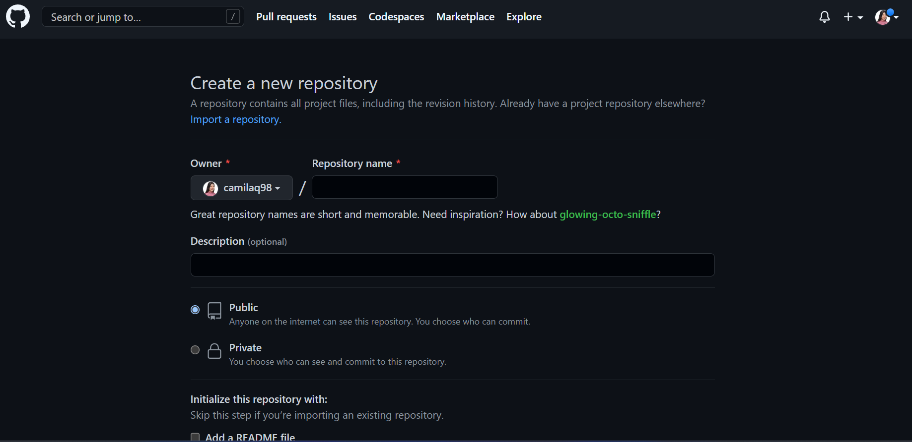
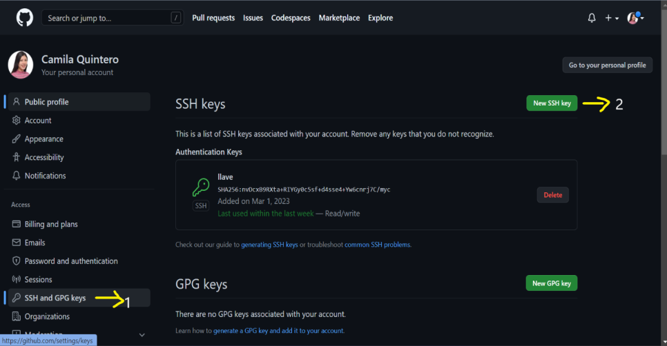

***<h1 align="center">TALLER 1 DOCKER</h1>***

***CONFIGURACIÓN DE HERRAMIENTAS DE DESARROLLO*** 

Se tiene el visual para realizar los códigos necesarios y en el moba está instalada la máquina de AWS para la ejecución de los comandos.

***CREAR CUENTA EN GITHUB*** 

Para crear la cuenta debes ingresar al siguiente link: https://github.com/join 
.Te aparecerá una ventana como la que se muestra a continuación.

  

Llenas todos los campos y a continuación estarás dentro de tu cuenta. La ventana se mostrará de la siguiente manera:

  

***CREAR CUENTA EN DOCKERHUB***

Para crear la cuenta debes ingresar al siguiente link: https://hub.docker.com/signup
.Te aparecerá una ventana como la que se muestra a continuación.

  

Llenas todos los campos y a continuación estarás dentro de tu cuenta. La ventana se mostrará de la siguiente manera:

  

  

***CREACIÓN DEL REPOSITORIO***

  

 

Primero se debe dar click donde está señalado el #1 para que le aparezca la pantalla como se muestra en la imagen, al darle click en new que es el paso #2 te dirigirá a la siguiente ventana:

  

 

Diligencias el nombre que le quieres poner al repositorio, si lo deseas público o no y si deseas añadirle el archivo README. Al tener todos los pasos anteriores tu repositorio ha sido creado y te aparecerá la ventana de la siguiente manera:

  

 

En amarillo esta subrayado el nombre del repositorio y la rama que se creó dentro del mismo.

***CONFIGURACIÓN DE LLAVES SSH***

Para la generación de la llave se debe ejecutar el comando ssh-keygen en el servidor que estes trabajando, en este caso como la llave ya se habia creado nos dice que si queremos sobreescribir el archivo o dejamos la que ya se había generado. Por tanto decimos que no sobreescriba y la ejecución del comando se verá de la siguiente manera:

  

 

Al dirigirnos a la ruta que nos aparece de la generación de la llave en la imagen anterior podremos observar la llave en el archivo como se muestra a continuación. Esta la debemos copiar para luego añadirla en los próximos pasos del GitHub.

  

 

Como ya hemos copiado la llave generada por el servidor, ahora lo que haremos será la configuración directamente desde el GitHub, por tanto iremos a settings así como se muestra a continuación:

  

 

Luego debemos realizar el paso #1 y #2 así como aparece en la siguiente imagen:

  

 

A continuación debemos añadirle un título a la llave y donde dice key debemos poner la llave que se había copiado del servidor.

  

 

Con estos pasos ya tendriamos la llave generada por el servidor cargada en el GitHub. Para verificar que quedó de manera correcta, clonamos cualquier repositorio, dando en la pestaña code y luego copiando la URL del SSH, porque esta es la manera con la que nos podremos autenticar en la máquina de AWS. Los pasos serían como se ven subrayados en amarillo en la siguiente imagen:

  

 

Para la clonación del repositorio ejecutariamos el comando git clone URL-SSH. En este caso cloranos el repositorio ShellAdmin como lo hemos mostrado en las imagenes anteriores, los pasos se muestran a continuación:

  

 
